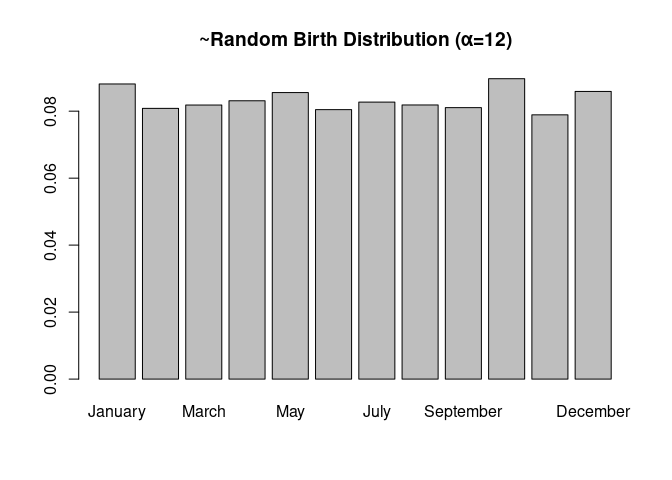
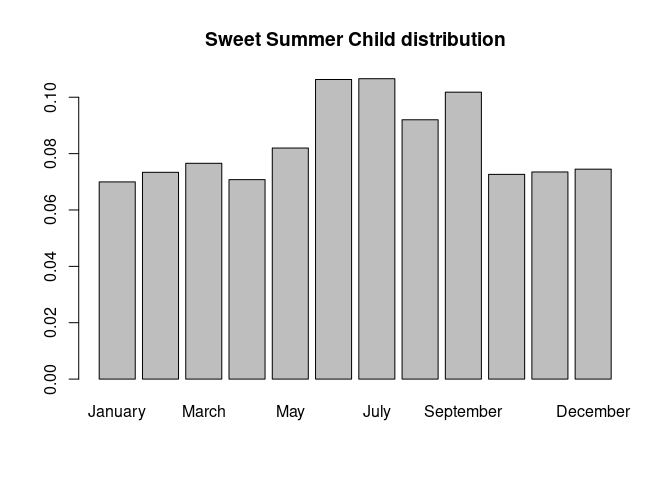
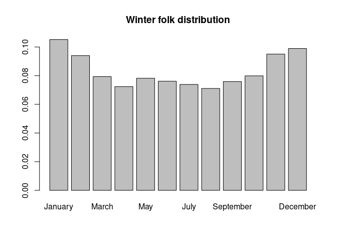
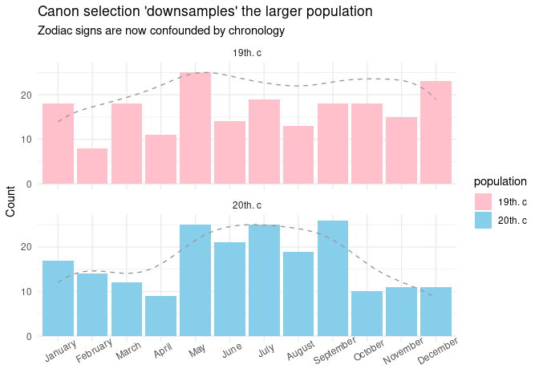
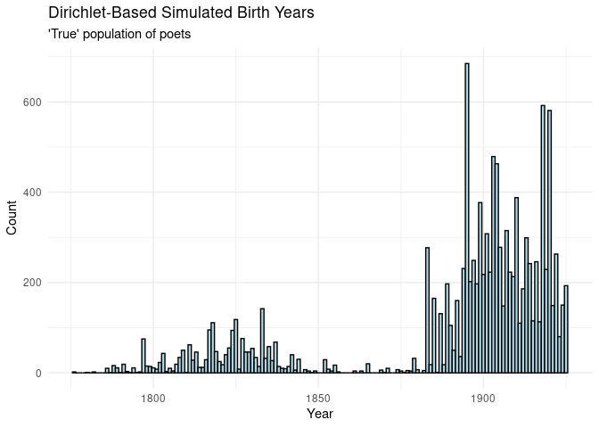
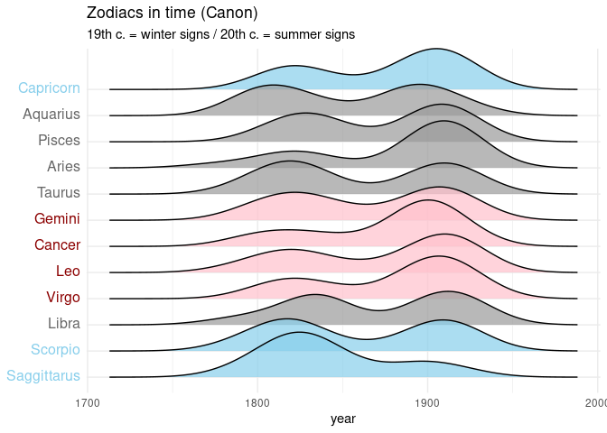
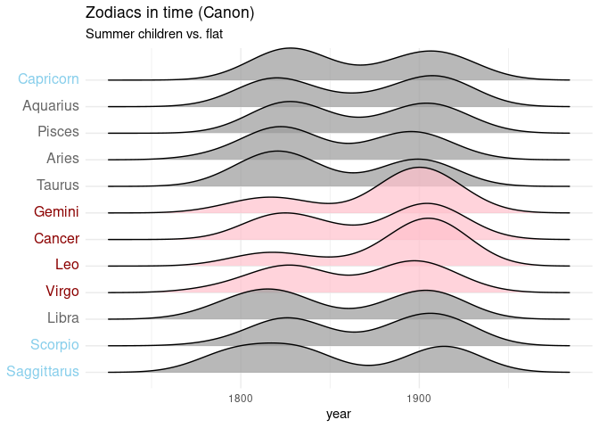
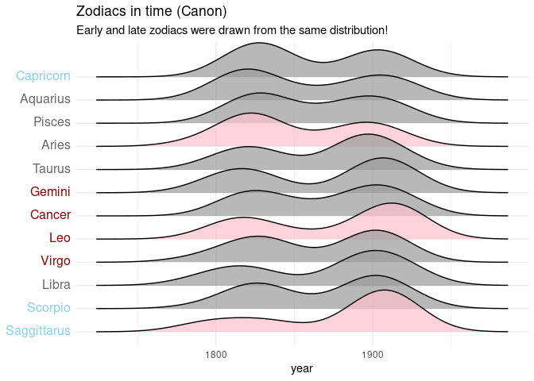

Zodiac simulation
================
Artjoms Šeļa
2025-05-02

- [The concept](#the-concept)
  - [Simulations](#simulations)
  - [Population and canon](#population-and-canon)
- [Signs over years](#signs-over-years)
  - [Summer and winter canon](#summer-and-winter-canon)
  - [Summer vs. flat](#summer-vs-flat)
  - [Pure sampling error](#pure-sampling-error)

# The concept

Why does chronological disparity in Zodiac sign distribution exists in
Russian poetry corpus? A likely explanation involves chronological
**differences in birth seasonality** and/or sampling error. First,
contemporary live births in Central and Eastern Europe [are
characterized by a ‘summer
peak’](https://www.researchgate.net/publication/299853248_Birth_Seasonality_Patterns_in_Central_and_Eastern_Europe_during_1996-2012)
(June / July), sometimes followed by another peak in September. This is
not universal and varies by socio-economic factors: more educated /
wealthy families tend to have more uniform patterns.

The “summer peak” was not necessary present historically: [studies
show](https://www.nature.com/articles/s41598-022-22159-3) “January to
June” shift across 200 years in rural Poland; similar pattern present in
Norway. This means we can expect **difference in seasonality** across
19th and 20th c. corpora.

This difference is likely present in all historical corpora, yet only
Russian shows signs of chronological confounding. Why? Because only
Russian corpus, by design, strongly follows academic canon, and thus
does not accurately reflect the population of poetry / poetic books.
Canon introduces selection and sampling error.

## Simulations

We can use Dirichlet distribution to get different ‘scenarios’ of births
in a yearly cycle (12 months). It uses alpha parameter (‘weight’) for
each category, returning a probability distribution that sums to 1.
Let’s consider three of them:

**1. Uniform, or low seasonality.**

``` r
a1 <- rep(12, 12)

set.seed(3)
probs_flat <- colMeans(rdirichlet(50, a1))

barplot(probs_flat, names.arg = month.name, main = "~Random Birth Distribution (α=12)")
```

<!-- -->

**2. “Sweet Summer child” with June, July, and September peaks**

``` r
a2 <- c(7,7,7,7,8,10,10,8,10,7,7,7)  # higher α = more expected births

set.seed(31)
probs_june <- colMeans(rdirichlet(100, a2))

barplot(probs_june, names.arg = month.name, main = "Sweet Summer Child distribution")
```

<!-- -->

**3. Winter folk with the peak in December/January**

``` r
# 3. December and January
a3 <- c(10,9,8,7,7,7,7,7,7,8,9,10)

set.seed(189)
probs_jan <- colMeans(rdirichlet(100, a3))

barplot(probs_jan, names.arg = month.name, main = "Winter folk distribution")
```

<!-- -->

## Population and canon

Now let’s imagine a population of poets that consists of ‘early’ and
‘late’ subpopulations There much more ‘late’ poets than ‘early’, since
the growth likely follows the growth of cities / educated population.
Each of these groups follows different birth seasonality: the early one
(let’s say) has the more uniform one. The later have the general
European “summer child” shape.

``` r
## "19th c." population: small, following uniform 
set.seed(1989)
p1 <- sample(month.name,size = 2000, prob = probs_flat,replace = T)
## "20th c." population" large, peak in summer / September
set.seed(1881)
p2 <- sample(month.name,size= 10000, prob= probs_june, replace=T)
```

If we aggregate over all these poets, it’s obvious that the birth
pattern of “Summer children” will overwhelm the early ‘uniform’ one.

``` r
tibble(month=p1,population="19th c.") %>% 
  bind_rows(tibble(month=p2,population="20th c.")) %>% 
  mutate(month=factor(month,levels=month.name)) %>% 
  ggplot(aes(month)) + geom_bar(aes(fill=population)) + 
  labs(title="Seasonal differences in birth is swamped by larger population") + 
  theme_minimal() +
  theme(axis.text.x = element_text(angle=30)) + 
  scale_fill_manual(values=c("pink","skyblue"))
```

<!-- -->

Now, if we disproportionally select from each period, effectively
‘downsampling’ the larger population, we will get back to the
differences.

``` r
set.seed(19001)
pc1 <- sample(p1,size=200)
set.seed(13)
pc2 <- sample(p2,size=200)

df <- tibble(month=pc1,population="19th. c") %>%
  bind_rows(tibble(month=pc2,population="20th. c")) %>% 
  mutate(month=factor(month,levels=month.name))
  
df %>% ggplot(aes(month)) + geom_bar(aes(fill=population)) +
  stat_density(
    aes(x = as.numeric(month), y = after_stat(scaled) * 25),
    bw = 1,
    color="grey60",
    geom = "line",
    linetype=2
  ) +
  labs(title="Canon selection 'downsamples' the larger population",subtitle="Zodiac signs are now confounded by chronology") + facet_wrap(~population,ncol = 1) + theme_minimal() + theme(axis.text.x = element_text(angle=30)) + scale_fill_manual(values=c("pink","skyblue")) + labs(x=NULL,y="Count")
```

<!-- -->

# Signs over years

Let’s now combine this simulation with Zodiacs and births over 150
years. First let’s simulate births over 150 years **assuming two peaks
in the population**: one around 1820s (Revival) and one around 1910s
(Modernism). Let’s also have an artificial midpoint in the year 1875.
Everyone born before will be assigned as ‘early’, everyone born after
will be assigned as ‘late’.

``` r
years <- 1775:1925

## get alphas for years
set.seed(1899)
alpha1 <- dnorm(years, mean = 1820, sd = 15) * 100
set.seed(190)
alpha2 <- dnorm(years, mean = 1910, sd = 15) * 100

## probabilities for each of the peaks
set.seed(180)
prob1 <- rdirichlet(1, alpha1)
set.seed(1771)
prob2 <- rdirichlet(1, alpha2)

## difference in populations size
set.seed(14)
sim_births1 <- sample(years, size = 2000, replace = TRUE, prob = prob1)
set.seed(10101)
sim_births2 <- sample(years, size = 10000, replace = TRUE, prob = prob2)
```

This is how it looks like. Modernism is crowded.

``` r
df <- tibble(year = c(sim_births1,sim_births2),cohort=ifelse(year < 1875, "early", "late"))

ggplot(df, aes(x = year)) +
  geom_histogram(binwidth = 1, fill = "lightblue", color = "black") +
  labs(title = "Dirichlet-Based Simulated Birth Years", subtitle = "'True' population of poets" , x = "Year", y = "Count") +
  theme_minimal()
```

<!-- --> Now
late and early groups will be born following “winter” and “summer” birth
seasonality pattern accordingly.

``` r
# 1. more or less uniform
a1 <- rep(12, 12)

set.seed(2)
probs_flat <- colMeans(rdirichlet(50, a1))

# 2. June & July & September OR Cancer & Leo & Virgo
a2 <- c(7,7,7,7,8,10,10,8,10,7,7,7)  # higher α = more expected births

set.seed(3)
probs_june <- colMeans(rdirichlet(50, a2))

# 3. December & January OR Sagittarius & Capricorn
a3 <- c(10,9,8,7,7,7,7,7,7,8,9,10)

set.seed(4)
probs_jan <- colMeans(rdirichlet(50, a3))


zodiacs <- c("Capricorn","Aquarius", "Pisces", "Aries","Taurus", "Gemini",
             "Cancer","Leo","Virgo","Libra","Scorpio","Saggittarus")

## zodiacs according to early pattern
set.seed(1989)
z1 <- sample(zodiacs,nrow(df[df$cohort == 'early',]),prob = probs_jan,replace = T)
## zodiacs according to late pattern
set.seed(14101)
z2 <- sample(zodiacs,nrow(df[df$cohort == 'late',]), prob = probs_june,replace = T)


dfz <- df[df$cohort=="early",] %>% mutate(zodiac=z1) %>% 
  bind_rows(df[df$cohort=="late",] %>% mutate(zodiac=z2)) 
```

If we look jointly on the whole population, zodiacs will cluster in
20th. and seemingly won’t have any chronological bias.

``` r
dfz %>% mutate(zodiac=factor(zodiac, levels=rev(zodiacs))) %>%
  ggplot(aes(year,zodiac)) +
  geom_density_ridges(alpha=0.7,fill="skyblue") + theme_minimal() + labs(title="Zodiacs in time", subtitle = "Signs follow the overall population shape")
```

<!-- -->

## Summer and winter canon

Until, of course we apply the ‘canon’ selection.

``` r
## canon unproportional 'selection'
set.seed(40)
df1 <- dfz[dfz$cohort == 'early',] %>% sample_n(125)
set.seed(81)
df2 <- dfz[dfz$cohort == 'late',] %>% sample_n(150)
df_canon <- bind_rows(df1,df2)


colours <- c("skyblue", "grey40", "grey40", "grey40", "grey40", "darkred", "darkred", "darkred", "darkred", "grey40","skyblue","skyblue")

sign_labels <- setNames(
  paste0("<span style='color:", colours[1:length(zodiacs)], "'>", zodiacs, "</span>"),
  zodiacs
)

zodiac_labels <- tibble(zodiac=zodiacs,gr=c("w", "n","n", "n", "n","s","s","s","s","n","w","w"))

df_canon %>% left_join(zodiac_labels) %>%  mutate(zodiac=factor(zodiac, levels=rev(zodiacs))) %>%
  
  ggplot(aes(year,zodiac)) +
  geom_density_ridges(aes(fill=gr),alpha=0.7) + theme_minimal() + labs(title="Zodiacs in time (Canon)", subtitle = "19th c. = winter signs / 20th c. = summer signs",y=NULL) +
  scale_y_discrete(labels = sign_labels) + theme(axis.text.y=element_markdown(size=12)) + guides(fill="none") + scale_fill_manual(values=c("grey60", "pink", "skyblue"))
```

<!-- -->

## Summer vs. flat

Obviously the chronological structure will also emerge if the ‘early’
authors were driven by more uniform distribution.

``` r
## zodiacs according to early pattern - flat distribution
set.seed(1989)
z1 <- sample(zodiacs,nrow(df[df$cohort == 'early',]),prob = probs_flat,replace = T)
## zodiacs according to late pattern - summer children
set.seed(14101)
z2 <- sample(zodiacs,nrow(df[df$cohort == 'late',]), prob = probs_june,replace = T)

dfz <- df[df$cohort=="early",] %>% mutate(zodiac=z1) %>% 
  bind_rows(df[df$cohort=="late",] %>% mutate(zodiac=z2)) 

set.seed(18)
df1 <- dfz[dfz$cohort == 'early',] %>% sample_n(125)
set.seed(19)
df2 <- dfz[dfz$cohort == 'late',] %>% sample_n(150)
df_canon <- bind_rows(df1,df2)

zodiac_labels <- tibble(zodiac=zodiacs,gr=c("n", "n","n", "n", "n","s","s","s","s","n","n","n"))

df_canon %>% left_join(zodiac_labels) %>%
  mutate(zodiac=factor(zodiac, levels=rev(zodiacs))) %>%
  ggplot(aes(year,zodiac)) +
  geom_density_ridges(aes(fill=gr),alpha=0.7) + theme_minimal() + labs(title="Zodiacs in time (Canon)", subtitle = "Summer children vs. flat",y=NULL) +
  scale_y_discrete(labels = sign_labels) + theme(axis.text.y=element_markdown(size=12)) + guides(fill="none") + scale_fill_manual(values=c("grey60", "pink"))
```

<!-- -->

## Pure sampling error

And, if gods are feeling fancy with luck, the difference can emerge
simply from sampling error! Oops.

``` r
## zodiacs according to early pattern - flat distribution
set.seed(1989)
z1 <- sample(zodiacs,nrow(df[df$cohort == 'early',]),prob = probs_flat,replace = T)
## zodiacs according to late pattern - flat distribution
set.seed(14101)
z2 <- sample(zodiacs,nrow(df[df$cohort == 'late',]), prob = probs_flat,replace = T)

dfz <- df[df$cohort=="early",] %>% mutate(zodiac=z1) %>% 
  bind_rows(df[df$cohort=="late",] %>% mutate(zodiac=z2)) 

set.seed(18)
df1 <- dfz[dfz$cohort == 'early',] %>% sample_n(125)
set.seed(19)
df2 <- dfz[dfz$cohort == 'late',] %>% sample_n(150)
df_canon <- bind_rows(df1,df2)

zodiac_labels <- tibble(zodiac=zodiacs,gr=c("n", "n","n", "s", "n","n","n","s","n","n","n","s"))

df_canon %>% left_join(zodiac_labels) %>%
  mutate(zodiac=factor(zodiac, levels=rev(zodiacs))) %>%
  ggplot(aes(year,zodiac)) +
  geom_density_ridges(aes(fill=gr),alpha=0.7) + theme_minimal() + labs(title="Zodiacs in time (Canon)", subtitle = "Early and late zodiacs were drawn from the same distribution!",y=NULL) +
  scale_y_discrete(labels = sign_labels) + theme(axis.text.y=element_markdown(size=12)) + guides(fill="none") + scale_fill_manual(values=c("grey60","pink"))
```

<!-- -->
